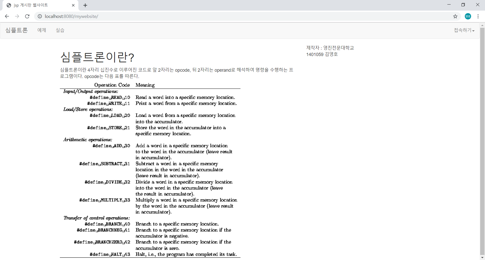
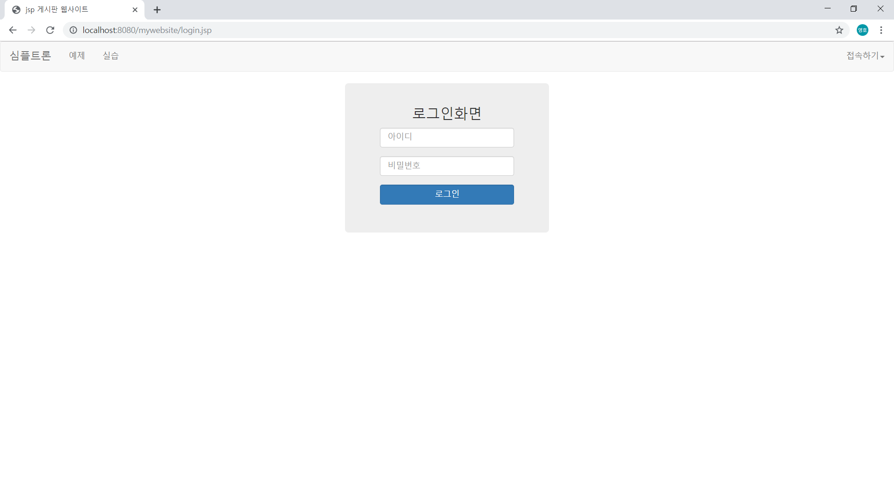
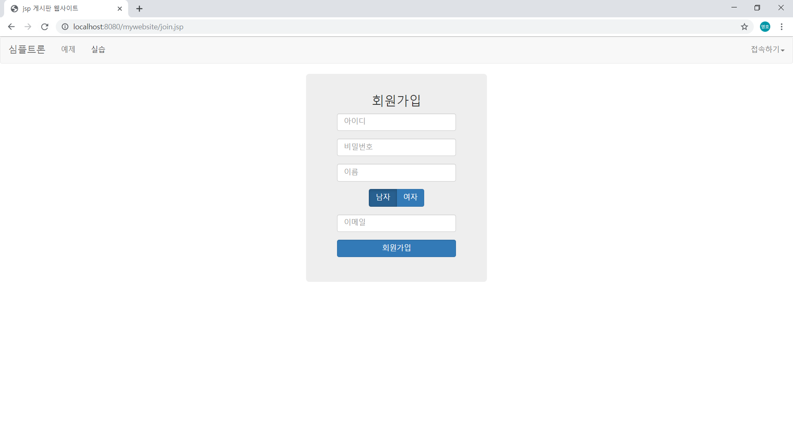
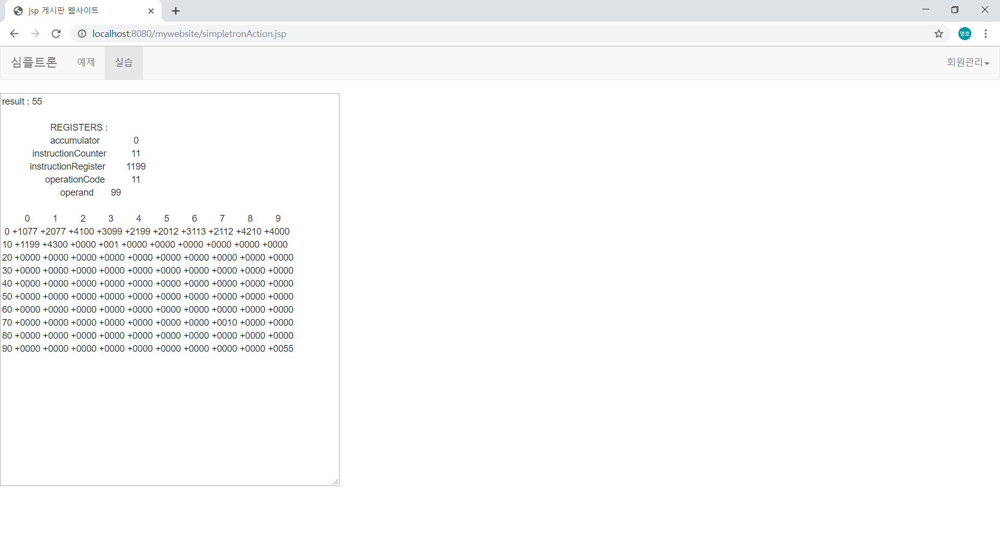

# simpletron

MVC 패턴을 이용한 웹 게시판   
호스팅 비용 문제로 스크린샷으로 대체   
로컬 톰캣 서버에서 구동한 모습

## 스크린샷
-------

   
<index.jsp>   

   
<bbs.jsp>   
심플트론 코드를 서로 공유   

   
<view.jsp>   

   
<login.jsp>   

   
<join.jsp>   

   
<simpletron.jsp>   
왼쪽 textarea에는 심플트론 코드를, 오른쪽 textarea에는 값을 적음(10개의 정수를 받아 합을 출력하는 예제)   

   
<result.jsp>   

## 심플트론머신
*****
자바빈즈를 이용해 jsp와 자바 객체간의 데이터 송수신  
4자리 심플트론코드를 앞, 뒤 두 자리씩 opcode와 operand로 분리  
simpletron.java의 execute() 메소드에서 switch문으로 opcode에 따라 작업 처리  
